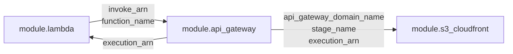

# はじめに

Terraform を書き始めると、最初はすべてのリソースを1つの `main.tf` に書きがちです。小規模なうちは問題ありませんが、リソースが増えるにつれて「どこに何があるか分からない」「環境ごとに同じコードをコピーしている」という状態になっていきます。

この記事では、S3 + CloudFront + API Gateway + Lambda + Amazon Bedrock のサーバーレス構成を例に、モジュール設計の考え方と実装パターンを整理します。

対象読者は「Terraform は書けるけどモジュール分割をどうすべきか迷っている人」です。

# Terraform の「モジュール」とは？
Terraformの **Module（モジュール）** は、一言でいうと「複数のリソースを1つの部品としてまとめて再利用できる仕組み」です。

https://developer.hashicorp.com/terraform/language/modules

# なぜモジュールに分けるのか

モジュール化の目的は主に3つです。

**1. 再利用性**
同じ構成を別環境（dev/stg/prod）にデプロイするとき、モジュールを呼ぶだけで済む。

**2. 変更の影響範囲を限定する**
Lambda の設定を変えたいとき、Lambda モジュールだけ触れば CloudFront の設定に影響しないことが保証される。

**3. 可読性**
`environments/dev/main.tf` を見れば「このシステムがどのモジュールで構成されているか」が一目でわかる。


# 今回の構成
今回モジュールに設計について解説するリポジトリのディレクトリ構成は下記になります（このリポジトリはブログの一番下にURLを掲載しておりますので、よかったら参考にしていただけますと幸いです）。

**ディレクトリ構成**
```
terraform/
├── environments/
│   └── dev/
│       ├── main.tf        ← モジュールを呼び出すだけ
│       ├── variables.tf
│       ├── dev.tfvars
│       └── terraform.tf   ← バックエンド・プロバイダー設定
└── modules/
    ├── lambda/            ← Lambda 関数 + IAM ロール
    ├── api_gateway/       ← API Gateway (HTTP API)
    └── s3_cloudfront/     ← S3 + CloudFront Distribution
```

`environments/` がどの環境か（dev/stg/prod）を表し、`modules/` が機能単位の部品です。`environments/dev/main.tf` を見れば、このシステムが3つのモジュールで構成されていることがすぐわかります。

```hcl:environments/dev/main.tf
module "s3_cloudfront" {
  source = "../../modules/s3_cloudfront"
  ...
}

module "api_gateway" {
  source = "../../modules/api_gateway"
  ...
}

module "lambda" {
  source = "../../modules/lambda"
  ...
}
```


# モジュールの「分け方」

どこでモジュールを切るかには迷いやすいですが、今回は **AWSサービスの責務単位** で分けました。

| モジュール | 管理するリソース |
|---|---|
| `lambda` | Lambda関数、IAMロール、IAMポリシー |
| `api_gateway` | HTTP API、Integration、Route、Stage |
| `s3_cloudfront` | S3バケット、バケットポリシー、CloudFront Distribution、OAC |

この粒度にした理由は、各モジュールが「1つのことに責任を持つ」からです。たとえば Lambda の timeout を変えたいとき、`modules/lambda/main.tf` だけを変更すればよく、API Gateway や CloudFront の設定が影響を受けないことが明確です。

### 分けすぎ・まとめすぎに注意

極端な例として、「IAM だけを別モジュールにする」という分け方もできます。ただし小規模なプロジェクトでは、Lambda と IAM は常にセットで変更されるため、分けると却って管理が煩雑になります。一方で「全サービスを1つのモジュールにまとめる」と、再利用性も可読性も失われます。

チームやプロジェクト規模に合わせた判断が必要ですが、**「一緒に変更されるものは一緒に置く」** が基本の考え方です。


# モジュールの「つなぎ方」― inputs と outputs

モジュール間で値を受け渡す仕組みが `variables`（inputs）と `outputs` です。ここが設計の核心です。

### outputs でモジュール間の依存を明示する

今回の構成では、3つのモジュールが以下のように依存しています。



`module.lambda` と `module.api_gateway` は**相互依存**しています。Lambda は API Gateway の `execution_arn` を `aws_lambda_permission` で必要とし、API Gateway は Lambda の `invoke_arn` を Integration で必要とします。

Terraform はこの依存グラフを自動解決するため、呼び出し側でモジュールの適用順序を気にする必要はありません。
ただし、**循環参照**（リソースAを作るためにリソースBが必要で、同時にリソースBを作るためにリソースAが必要な状態のこと。Terraformは作成順序を決められず、エラーを出して止まってしまう）にならないよう設計することが重要です。

今回は「API Gateway の execution_arn → Lambda の Permission」「Lambda の invoke_arn → API Gateway の Integration」という形で、お互いが相手の output を使っているだけなので循環していません。

**循環参照**について
https://developer.hashicorp.com/terraform/tutorials/configuration-language/troubleshooting-workflow#correct-a-cycle-error

https://dev.classmethod.jp/articles/my-terraform-tips/

### outputs の定義

```hcl:modules/api_gateway/outputs.tf
output "api_gateway_domain_name" {
  value       = "${aws_apigatewayv2_api.main.id}.execute-api.${var.aws_region}.amazonaws.com"
  description = "APIGatewayで作成したAPIにアクセスするためのURL"
}

output "execution_arn" {
  value       = aws_apigatewayv2_api.main.execution_arn
  description = "LambdaのPermission設定で使用するAPI GatewayのExecution ARN"
}
```

```hcl:modules/lambda/outputs.tf
output "invoke_arn" {
  value = aws_lambda_function.chat.invoke_arn
}

output "function_name" {
  value = aws_lambda_function.chat.function_name
}
```

outputs に `description` を書く習慣をつけておくと、後から見たときに「なぜこの値を外に出しているのか」がわかりやすくなります。

### 呼び出し側での受け渡し

```hcl:environments/dev/main.tf
module "api_gateway" {
  source = "../../modules/api_gateway"

  lambda_invoke_arn    = module.lambda.invoke_arn      # Lambda の output を渡す
  lambda_function_name = module.lambda.function_name   # Lambda の output を渡す
}

module "lambda" {
  source = "../../modules/lambda"

  api_gateway_execution_arn = module.api_gateway.execution_arn  # API Gateway の output を渡す
}
```

`module.lambda.invoke_arn` という参照が `environments/dev/main.tf` に現れることで、**Lambda と API Gateway が依存関係にある** ことがコードから読み取れます。依存関係をドキュメントに書かなくても、コードが仕様書になっています。


# `aws_lambda_permission` をどちらのモジュールに置くか

設計で迷いやすいポイントです。`aws_lambda_permission` は「API Gateway が Lambda を呼び出すことを許可する」リソースで、API Gateway と Lambda の両方に関係します。

**aws_lambda_permission** について
https://registry.terraform.io/providers/hashicorp/aws/latest/docs/resources/lambda_permission

今回は **Lambda モジュールに置きました**。理由は2つです。

1. **Lambda の IAM ロールと同じモジュールで権限を一元管理したい**
2. **「この Lambda に対して誰が呼び出せるか」は Lambda の責務** という考え方

```hcl:modules/lambda/main.tf
resource "aws_lambda_permission" "apigw" {
  statement_id  = "AllowAPIGatewayInvoke"
  action        = "lambda:InvokeFunction"
  function_name = aws_lambda_function.chat.function_name
  principal     = "apigateway.amazonaws.com"
  source_arn    = "${var.api_gateway_execution_arn}/*/*"  # API Gateway から受け取る
}
```

`api_gateway_execution_arn` を変数で受け取ることで、Lambda モジュールは「誰から呼ばれるか」を知らなくても済みます。呼び出し元が API Gateway である必要はなく、変数を変えるだけで EventBridge や SQS に差し替えられます。


# `data` ソースをモジュール内で使う

`data` ソースはモジュール内でも普通に使えます。今回は Bedrock の IAM ポリシー ARN に現在のアカウント ID を埋め込む必要があったため、Lambda モジュール内で `aws_caller_identity` を取得しています。

**data ブロック** について
https://developer.hashicorp.com/terraform/language/data-sources

**aws_caller_identity** について
https://registry.terraform.io/providers/hashicorp/aws/4.0.0/docs/data-sources/caller_identity


```hcl:modules/lambda/main.tf
data "aws_caller_identity" "current" {}

resource "aws_iam_role_policy" "bedrock" {
  policy = jsonencode({
    Statement = [
      {
        Resource = "arn:aws:bedrock:${var.aws_region}:${data.aws_caller_identity.current.account_id}:inference-profile/apac.amazon.nova-pro-v1:0"
      }
    ]
  })
}
```

アカウント ID を変数で渡す方法もありますが、`data.aws_caller_identity` を使うと呼び出し側で意識する必要がなくなります。モジュールが自律的に必要な情報を取得できるため、インターフェース（variables）がシンプルに保てます。


# Lambdaコードのパッケージングを Terraform で行う

`archive_file` data ソースを使うと、Terraform がデプロイ前にソースコードを zip に固めてくれます。

**archive_file** について
https://registry.terraform.io/providers/hashicorp/archive/latest/docs/data-sources/file

```hcl:modules/lambda/main.tf
data "archive_file" "lambda_zip" {
  type        = "zip"
  source_dir  = "${path.module}/../../../lambda/chat"
  output_path = "${path.module}/lambda.zip"
}

resource "aws_lambda_function" "chat" {
  filename         = data.archive_file.lambda_zip.output_path
  source_code_hash = data.archive_file.lambda_zip.output_base64sha256
  ...
}
```

`source_code_hash` に `output_base64sha256` を指定することで、ソースコードが変わったときだけ Lambda 関数が更新されます。ハッシュが変わらなければ `terraform apply` しても Lambda は更新されません。

`path.module` はモジュールのディレクトリを指す組み込み変数です。`path.root`（`terraform apply` を実行したディレクトリ）と混同しやすいので注意が必要です。

```
terraform/
├── environments/dev/    ← path.root
└── modules/lambda/      ← path.module
```

`path.root` を使うと `environments/dev` からの相対パスになり、`path.module` を使うと `modules/lambda` からの相対パスになります。今回は `path.module` が正解です。


# S3 バケット名の個人識別子を変数に外出しする

S3 バケット名はグローバルで一意にする必要があるため、個人識別子や日付などのサフィックスを付けることが多いです。このサフィックスをモジュール内にハードコードすると、GitHub に個人情報が入ったり、他の環境でも同じバケット名を使おうとして衝突するリスクがあります。

```hcl
# ❌ ハードコード — GitHub にあげると個人識別子が公開される
bucket = "frontend-static-content-bucket-${var.env}-rio-20260630"

# ✅ 変数化 — 識別子は tfvars に閉じ込める
bucket = "frontend-static-content-bucket-${var.env}-${var.bucket_suffix}"
```

```hcl:modules/s3_cloudfront/variables.tf
variable "bucket_suffix" {
  type        = string
  description = "S3バケット名のサフィックス（例: yourname-20260630）。グローバル一意にするために使用"
}
```

```hcl:environments/dev/dev.tfvars
bucket_suffix = "rio-20260630"
```

`.tfvars` に閉じ込めることで、コードは汎用的に保ちながら環境ごとの値だけ分離できます。


# tfstate のリモート管理

ローカルの tfstate は Git に含めるべきではなく、チームで共有もできません。S3 バックエンドでリモート管理します。

```hcl:environments/dev/terraform.tf
terraform {
  backend "s3" {
    bucket       = "bedrock-ai-portfolio-remote-backend"
    key          = "dev/terraform.tfstate"
    region       = "ap-northeast-1"
    use_lockfile = true
  }
}
```

`use_lockfile = true` は Terraform 1.10 から追加されたオプションで、S3 の条件付き書き込みを使って同時更新を防ぎます。以前は DynamoDB によるロックが必要でしたが、このオプションを使えば DynamoDB テーブルが不要になります。

**use_lockfile** について
https://developer.hashicorp.com/terraform/language/backend/s3#use_lockfile-1

`key` を `dev/terraform.tfstate` にすることで、将来 `stg/terraform.tfstate`、`prod/terraform.tfstate` を同じバケットに共存させられます。


# まとめ（設計判断のチェックリスト）

Terraform のモジュール設計で判断が必要になる場面と、今回の選択をまとめます。

| 判断ポイント | 今回の選択 | 理由 |
|---|---|---|
| モジュールの粒度 | AWSサービス単位 | 変更の影響範囲が明確になる |
| `aws_lambda_permission` の置き場 | Lambda モジュール | 「誰が呼べるか」は Lambda の責務 |
| アカウントIDの取得 | モジュール内で `data` ソース | 変数インターフェースをシンプルに保つ |
| コードのパッケージング | `archive_file` で Terraform が行う | デプロイ手順を最小化 |
| S3バケット名の識別子 | `bucket_suffix` 変数に外出し | コードに個人識別子を含めない |
| tfstate の管理 | S3 バックエンド + `use_lockfile` | DynamoDB 不要で同時更新防止 |

モジュール設計に「唯一の正解」はありません。重要なのは「なぜこう分けたか」「なぜここに置いたか」という判断の根拠を自分で説明できることです。それができれば、プロジェクトが大きくなっても一貫した設計を維持できます。

今回作成した成果物は下記になります。よかったら参考にしていただけると幸いです。

https://github.com/Onepiece2424/bedrock-ai-portfolio
