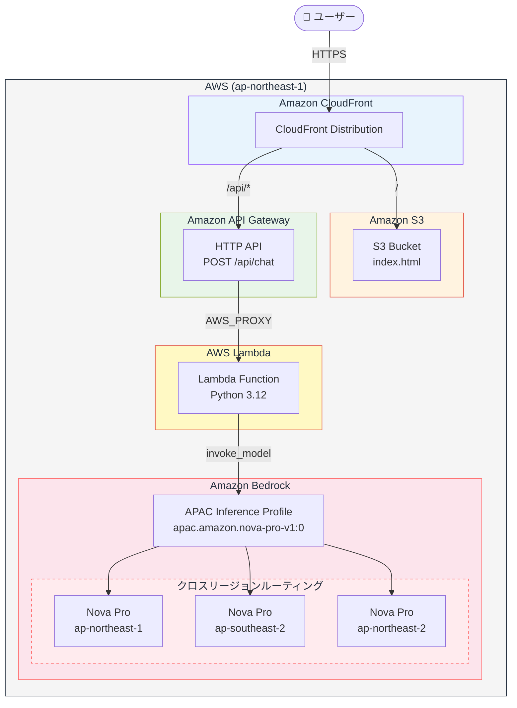
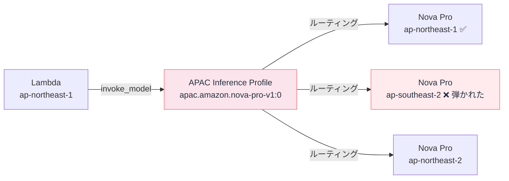

# はじめに

「ポートフォリオを作るなら、ただのプロフィールページより動くものを置きたい」と思い、Amazon Bedrock を使った AI チャットボット付きのポートフォリオサイトを作りました。

インフラはすべて Terraform で管理し、サーバーレス構成で完結しています。この記事では構成の設計から実装、ハマったポイントまで一通り書きます。

# 作ったもの

CloudFront で配信される静的サイトに、AI チャットボットを埋め込んだポートフォリオです。訪問者がメッセージを送ると、Lambda 経由で Amazon Bedrock を呼び出し、AI がポートフォリオの内容をもとに回答を返します。

**アーキテクチャ**


**リクエストの流れ**



**使用サービス**

| サービス | 用途 |
|---|---|
| S3 | 静的ファイルのホスティング |
| CloudFront | CDN 配信・HTTPS 終端 |
| API Gateway (HTTP API) | REST エンドポイントの提供 |
| Lambda | チャット処理のバックエンド |
| Amazon Bedrock (Nova Pro) | AI 応答の生成 |
| Terraform | インフラ全体のコード管理 |
| S3 backend | tfstate のリモート管理 |


# Terraform の構成

モジュールを機能単位で分割しています。

```
terraform/
├── environments/
│   └── dev/
│       ├── main.tf        # モジュール呼び出し
│       ├── variables.tf
│       ├── dev.tfvars
│       └── terraform.tf   # バックエンド・プロバイダー設定
└── modules/
    ├── lambda/            # Lambda + IAM
    ├── api_gateway/       # API Gateway
    └── s3_cloudfront/     # S3 + CloudFront
```

`environments/dev/main.tf` でルートモジュールを定義し、モジュール間の依存関係を整理しています。

```hcl:environments/dev/main.tf
module "lambda" {
  source = "../../modules/lambda"

  env                       = var.env
  aws_region                = var.aws_region
  project_name              = "bedrock-ai-portfolio"
  api_gateway_execution_arn = module.api_gateway.execution_arn
}
```

Lambda モジュールが API Gateway の `execution_arn` を受け取ることで、`aws_lambda_permission` を Lambda 側で完結させています。

**aws_lambda_permission** について

https://registry.terraform.io/providers/hashicorp/aws/4.27.0/docs/resources/lambda_function


# バックエンド：Lambda の実装

Lambda のコードは3ファイルで構成しています。

### エントリーポイント

```python:handler.py
import json
from bedrock_client import invoke_bedrock
from prompt import build_system_prompt

def lambda_handler(event, context):
    try:
        body = json.loads(event.get("body", "{}"))
        message = body.get("message", "").strip()

        if not message:
            return _response(400, {"error": "メッセージが空です"})

        system_prompt = build_system_prompt()
        answer = invoke_bedrock(system_prompt, message)

        return _response(200, {"answer": answer})

    except Exception as e:
        return _response(500, {"error": str(e)})

def _response(status, body):
    return {
        "statusCode": status,
        "headers": {
            "Content-Type": "application/json",
            "Access-Control-Allow-Origin": "*"
        },
        "body": json.dumps(body, ensure_ascii=False)
    }
```

シンプルに「リクエストを受け取り → Bedrock を呼び出し → レスポンスを返す」だけです。`ensure_ascii=False` を忘れると日本語が文字化けするので注意。

**ensure_ascii=False** について

https://docs.python.org/ja/3.13/library/json.html

### Bedrock 呼び出し

```python:bedrock_client.py
import boto3
import json

client = boto3.client("bedrock-runtime", region_name="ap-northeast-1")

def invoke_bedrock(system_prompt: str, user_message: str) -> str:
    body = {
        "schemaVersion": "messages-v1",
        "system": [{"text": system_prompt}],
        "messages": [
            {"role": "user", "content": [{"text": user_message}]}
        ],
        "inferenceConfig": {
            "max_new_tokens": 512
        }
    }

    response = client.invoke_model(
        modelId="apac.amazon.nova-pro-v1:0",
        body=json.dumps(body)
    )

    result = json.loads(response["body"].read())
    return result["output"]["message"]["content"][0]["text"]
```

### システムプロンプト定義

```python:prompt.py
def build_system_prompt() -> str:
    return """
あなたはポートフォリオサイトのAIアシスタントです。
以下の情報をもとに、訪問者の質問に日本語で答えてください。

## プロフィール
- 職種: AWSエンジニア / インフラエンジニア

## スキル
- IaC: Terraform
- クラウド: AWS（S3, CloudFront, Lambda, API Gateway, Bedrock）
- 言語: Python, JavaScript
...
"""
```

システムプロンプトを別ファイルに分けることで、AI の振る舞いを独立して管理できます。


# ハマったポイント① Claude 3 系がレガシー扱いに

最初は Claude 3 Sonnet を使う想定で実装していました。しかし `terraform apply` 後に Lambda を実行すると、こんなエラーが返ってきました。

```
ValidationException: Invocation of model ID anthropic.claude-3-sonnet-20240229-v1:0
with on-demand throughput isn't supported.
Retry your request with the ID or ARN of an inference profile that contains this model.
```

Claude 3 系は on-demand スループットが廃止されており、Inference Profile 経由でしか呼び出せなくなっていました。さらに調べると、Claude 3.5 系も含めて `LEGACY` ステータスに移行済みで、しばらく未使用のアカウントではアクセス拒否が返ります。

```bash
# 東京リージョン(ap-northeast-1)で利用可能なAnthropic製のBedrockモデル一覧を表示
aws bedrock list-foundation-models --region ap-northeast-1 \
  --query "modelSummaries[?contains(modelId, 'anthropic')].[modelId,modelLifecycle.status]" \
  --output table
```

```
| anthropic.claude-3-sonnet-20240229-v1:0   | LEGACY |
| anthropic.claude-3-5-sonnet-20241022-v2:0 | LEGACY |
```

そのため **Amazon Nova Pro** に切り替えました。Nova Pro は ACTIVE なモデルであり、APAC Inference Profile（`apac.amazon.nova-pro-v1:0`）でも利用可能です。

https://docs.aws.amazon.com/ja_jp/bedrock/latest/userguide/model-card-amazon-nova-pro.html

また、Claude 系と Nova 系ではリクエストのスキーマが異なる点に注意が必要です。

**Claude 系（Anthropic Messages API）**
```json
{
  "anthropic_version": "bedrock-2023-05-31",
  "max_tokens": 512,
  "system": "...",
  "messages": [{"role": "user", "content": "..."}]
}
```

**Nova 系（messages-v1）**
```json
{
  "schemaVersion": "messages-v1",
  "system": [{"text": "..."}],
  "messages": [
    {"role": "user", "content": [{"text": "..."}]}
  ],
  "inferenceConfig": {"max_new_tokens": 512}
}
```

`system` フィールドが文字列からオブジェクト配列になり、`messages` の `content` もオブジェクト配列になります。レスポンスのパスも変わります。

```python
# Claude
result["content"][0]["text"]

# Nova
result["output"]["message"]["content"][0]["text"]
```


# ハマったポイント② APAC Inference Profile の IAM 権限

Nova Pro に切り替えた後も、Lambda 実行時に `AccessDeniedException` が発生しました。

```
User: arn:aws:sts::xxxx:assumed-role/bedrock-ai-portfolio-lambda-role/...
is not authorized to perform: bedrock:InvokeModel on resource:
arn:aws:bedrock:ap-southeast-2::foundation-model/amazon.nova-pro-v1:0
```

エラーを見て気づいたのが、Bedrockで推論を実行した **リージョンが `ap-southeast-2`（シドニー）になっていました**。
Lambda は東京（`ap-northeast-1`）で動いているのに、なぜシドニーが出てくるのか疑問でした。

色々調べると、今回の現象が起きた原因としては、**APAC Inference Profile がシドニーのモデルへ自動ルーティングしたのに、IAM ポリシーは東京リージョンのモデルしか許可していなかったため**です（下記のドキュメントに APAC Inference Profile に関する仕組みが書かれていました）。

つまり、原因は **クロスリージョン推論の動作を考慮せずに IAM ポリシーを設定していたこと** です。

https://docs.aws.amazon.com/ja_jp/bedrock/latest/userguide/inference-profiles-support.html

https://dev.classmethod.jp/articles/understanding-amazon-bedrock-cross-region-inference/

上記のドキュメントより、**APAC Inference Profile**（Amazon Bedrockが提供する「クロスリージョン推論」機能において、アジア・太平洋地域（APAC）の複数のAWSリージョン（東京、シンガポール、シドニーなど）にまたがってAIモデルへのリクエストを自動的に負荷分散する仕組み） は「**クロスリージョンインファレンス**」の仕組みで動いており、東京・シドニー・ソウルなど複数リージョンの foundation-model に負荷分散します。

今回の場合、API呼び出しとして使用していたLambdaにアタッチしていたIAM ポリシーで `ap-northeast-1` のみを許可していたため、シドニーへのルーティング時に弾かれていました。
図にすると下記のような感じです。



どのリージョンにルーティングされるかは **Bedrock 側が制御する**ため、呼び出し元では制御できません。

解決策としては **IAM ポリシーを2つの Statement に分けること** です。

```hcl:terraform/modules/lambda/main.tf
resource "aws_iam_role_policy" "bedrock" {
  name = "${var.project_name}-bedrock-policy"
  role = aws_iam_role.lambda_exec.id

  policy = jsonencode({
    Version = "2012-10-17"
    Statement = [
      {
        # Inference Profile 自体への呼び出し（東京リージョン固定）
        Effect   = "Allow"
        Action   = ["bedrock:InvokeModel"]
        Resource = "arn:aws:bedrock:${var.aws_region}:${data.aws_caller_identity.current.account_id}:inference-profile/apac.amazon.nova-pro-v1:0"
      },
      {
        # クロスリージョンで呼ばれる foundation-model（全リージョン許可）
        Effect   = "Allow"
        Action   = ["bedrock:InvokeModel"]
        Resource = "arn:aws:bedrock:*::foundation-model/amazon.nova-pro-v1:0"
      }
    ]
  })
}
```

上記のように、Inference Profile の ARN はアカウント ID 付きのリージョン固定 ARN、foundation-model の ARN はリージョンをワイルドカードにするという組み合わせを用いることで、Bedrockの推論時の自動ルーティングにも対応できるようにしました。

振り返ると、今回の内容を実装する際に、推論プロファイルのソースリージョンと送信先リージョン のそれぞれの対応リージョンを把握しておけばよかったなと思いました。
先ほどのドキュメントを見返してみると、下記のような記載がありました。

>推論プロファイルのソースリージョンと送信先リージョンを確認するには、次のいずれかを実行します。
>- サポートされているクロスリージョン推論プロファイルのリストの対応するセクションを展開します。
>- ソースリージョンから Amazon Bedrock コントロールプレーンエンドポイントを使用して GetInferenceProfile リクエストを送信し、inferenceProfileIdentifier フィールドに推論プロファイルの Amazon リソースネーム (ARN) または ID を指定します。レスポンスの models フィールドは、各送信先リージョンを識別できるモデル ARN のリストにマッピングされます。

つまり、推論プロファイルを使うと、**どのリージョンからどのリージョンへリクエストが転送されるかは事前に確認できた**ようです。

https://docs.aws.amazon.com/ja_jp/bedrock/latest/userguide/inference-profiles-support.html

# CloudFront の /api/* ルーティング

SPA のように1つの CloudFront ディストリビューションから静的ファイルと API の両方を配信するため、`/api/*` のパスだけ API Gateway オリジンにルーティングしています。

```hcl:terraform/modules/s3_cloudfront/main.tf
ordered_cache_behavior {
  path_pattern             = "/api/*"
  target_origin_id         = "api-origin"
  viewer_protocol_policy   = "redirect-to-https"
  cache_policy_id          = data.aws_cloudfront_cache_policy.caching_disabled.id
  origin_request_policy_id = data.aws_cloudfront_origin_request_policy.all_viewer_except_host_header.id
  ...
}
```

ポイントは2つです。

**キャッシュを無効化する**
`cache_policy_id` に `CachingDisabled` マネージドポリシーを指定します。API レスポンスがキャッシュされると、ユーザーごとに異なる応答が返るべき場面で古いレスポンスが返ってしまいます。

https://docs.aws.amazon.com/ja_jp/AmazonCloudFront/latest/DeveloperGuide/using-managed-cache-policies.html#managed-cache-policy-caching-disabled

**`Host` ヘッダーを除外する**
`origin_request_policy_id` に `AllViewerExceptHostHeader` を指定します。CloudFront が API Gateway にリクエストを転送する際、`Host` ヘッダーをそのまま渡すと API Gateway がリジェクトするためです。

https://docs.aws.amazon.com/ja_jp/AmazonCloudFront/latest/DeveloperGuide/using-managed-origin-request-policies.html#managed-origin-request-policy-all-viewer-except-host-header

# ローカルでの動作確認方法

`terraform apply` 前にローカルで Bedrock 疎通確認ができます。

```bash
# LambdaのPythonコードを配置しているディレクトリへ移動
cd lambda/chat

# Pythonの仮想環境(.venv)を作成
# ライブラリをシステム環境と分離して管理するため
python3 -m venv .venv

# 作成した仮想環境を有効化
# 以降のpipやpythonは、この仮想環境内で実行される
source .venv/bin/activate

# AWS SDK for Python(boto3)をインストール
# Bedrock APIを呼び出すために必要
pip install boto3

# Bedrockの動作確認用スクリプトを実行
# Bedrockへリクエストを送り、正常にレスポンスが返るか確認する
python3 test_bedrock.py
```

デプロイ後は AWS CLI で Lambda を直接 invoke してもテストできます。

```bash
# AWS CLIからLambda関数を直接呼び出し、「こんにちは」というメッセージをAPI Gateway経由と同じ形式で渡して実行し、レスポンスをresponse.jsonに保存した後、jqで整形して表示する
aws lambda invoke \
  --function-name bedrock-ai-portfolio-chat \
  --region ap-northeast-1 \
  --payload '{"body": "{\"message\": \"こんにちは\"}"}' \
  --cli-binary-format raw-in-base64-out \
  response.json && cat response.json | jq .
```


# まとめ

今回の実装で得た知見をまとめます。

- **Claude 3 系は 2025 年時点でレガシー扱い**。新規構築なら Nova Pro など ACTIVE なモデルを選ぶのが無難
- **APAC Inference Profile はクロスリージョン**。IAM ポリシーの foundation-model ARN はリージョンをワイルドカードにしないと別リージョンへのルーティング時に弾かれる
- **CloudFront で静的サイトと API を同一ドメインで配信**すると、フロントエンドの API 呼び出しを相対パスで書けて CORS も不要になる
- **Terraform のモジュール分割**はサービス単位が扱いやすい。モジュール間の依存は outputs と variables でつなぐ

今回作成したポートフォリオは、下記のGitHubリポジトリに公開していますので、よかったら参考にしていただけますと幸いです。

https://github.com/Onepiece2424/bedrock-ai-portfolio
